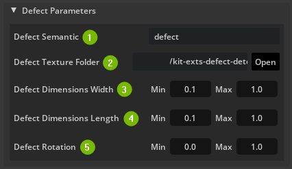
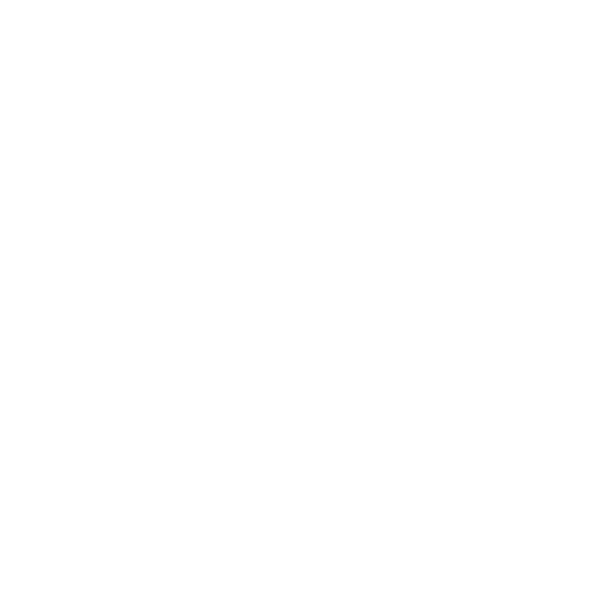
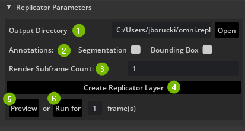
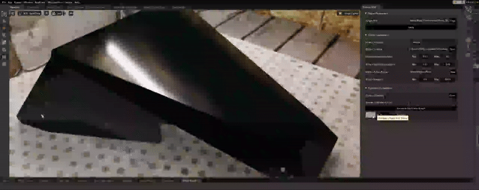

# Defects Sample Extension (omni.sample.defects)

## Overview

The Defects Sample Extension allows users to choose a texture, that represents a defect, to apply to a [Prim](https://docs.omniverse.nvidia.com/prod_usd/prod_usd/quick-start/prims.html) and generate synthetic data of the position, rotation, and dimensions of that texture.

This Sample Extension utilizes Omniverse's [Replicator](https://developer.nvidia.com/omniverse/replicator) functionality for randomizing and generating synthetic data.

## UI Overview

### Object Parameters

1. Target Prim
    - This defines what prim the material to apply to. To get the prim path, **select** a prim in the scene then hit the **Copy button**
2. Apply
    - Once you have a Target Prim selected and Copied it's path, hitting Apply will bring in the proxy, decal material and create the primvar's on the Target Prim.

### Defect Parameters

Randomizations are based on Replicator's [Distributions](https://docs.omniverse.nvidia.com/prod_extensions/prod_extensions/ext_replicator/distribution_examples.html)

1. Defect Semantic
    - The semantic label that will be used to represent the defect in the output file produced by Replicator.
    - Default Value: `defect`
2. Defect Texture Folder
    - A folder location that holds all the texture(s) to choose from. Textures should be in PNG format.
    - Default Value: data folder within the Defect Extension

    - Defect textures are composed of a Diffuse, Normal, and Roughness texture to represent the defect. Example shown below:

    Diffuse Texture |  Normal Texture | Roughness Texture
    :-------------------------:|:-------------------------:|:-------------------------:
      |   | 

3. Defect Dimensions Width
    - Replicator will choose random values between the Min and Max defined (cms)
    - Default Value Min: `0.1`
    - Default Value Max: `1`

4. Defect Dimensions Length
    - Replicator will choose random values between the Min and Max defined (cms) 
    - Default Value Min: `0.1`
    - Default Value Max: `1`

5. Defect Rotation
    - Replicator will choose random values between the Min and Max defined (cms) and will set that rotation.
    - Default Value Min: `0.1`
    - Default Value Max: `1`

A recommended set of values using the CarDefectPanel scene is the following:
 - Defect Semantics: Scratch
 - Defect Texture: [Path to Scratchs located in Extension]
 - Defect Dimensions Width: Min 0.1 Max 0.2
 - Defect Dimensions Length: Min 0.15 Max 0.2
 - Defect Rotation: Min 0 Max 360

### Replicator Parameters

1. Output Directory
    - Defines the location in which Replicator will use to output data. By default it will be `DRIVE/Users/USER/omni.replicator_out`
2. Annotations
    - There are two types of annotations you can choose from: Segmentation and/or Bounding Box. You can select both of these. For other annotation options you will need to adjust the code inside the extension.
3. [Render Subframe](https://docs.omniverse.nvidia.com/prod_extensions/prod_extensions/ext_replicator/subframes_examples.html) Count
    - If rendering in RTX Realtime mode, specifies the number of subframes to render in order to reduce artifacts caused by large changes in the scene.
4. Create Replicator Layer
    - Generates the [OmniGraph](https://docs.omniverse.nvidia.com/prod_extensions/prod_extensions/ext_omnigraph.html) or Omni.Replicator graph architecture, if changes are made the user can click this button to reflect changes. This does not run the actual execution or logic.
5. Preview 
    - **Preview** performs a single iteration of randomizations and prevents data from being written to disk.
6. Run for X frames
    - **Run for**  will run the generation for a specified amount of frames. Each frame will be one data file so 100 frames will produce 100 images/json/npy files.

